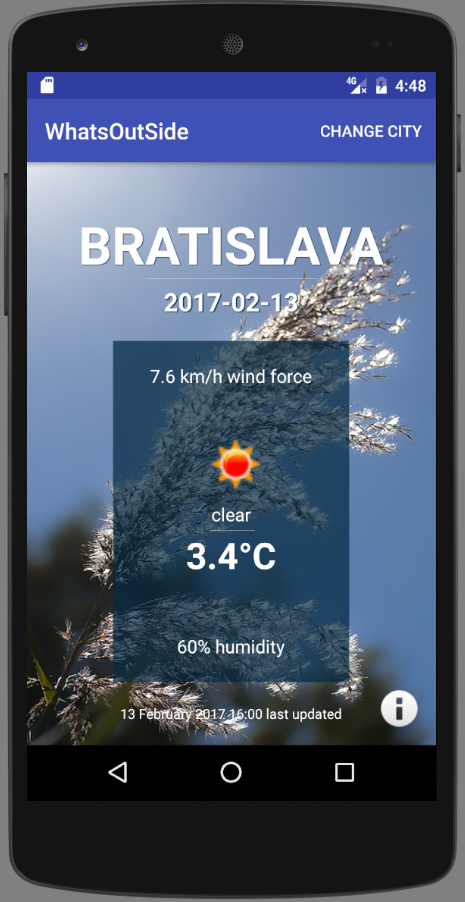
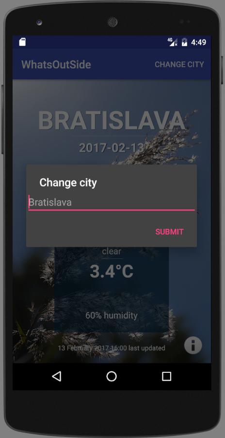
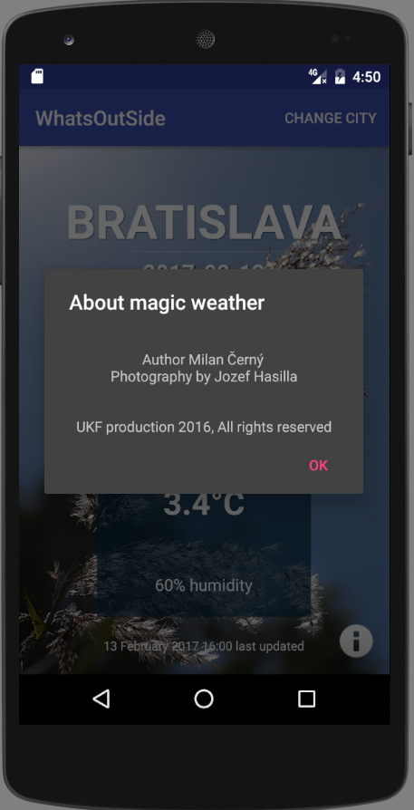

# WhatsOutSide :octocat:
School project for Android subject. The basic concept for the request. 
Sample parse JSON objects.


## OpenWeathermap
Based on [https://openweathermap.org/]()

Weather conditions [https://openweathermap.org/weather-conditions]()

## Example respons body
```javascript
{
   "coord":{
      "lon":17.59,
      "lat":48.38
   },
   "weather":[
      {
         "id":804,
         "main":"Clouds",
         "description":"overcast clouds",
         "icon":"04d"
      }
   ],
   "base":"stations",
   "main":{
      "temp":-1.5,
      "pressure":1024,
      "humidity":86,
      "temp_min":-2,
      "temp_max":-1
   },
   "visibility":10000,
   "wind":{
      "speed":1
   },
   "clouds":{
      "all":90
   },
   "dt":1481720400,
   "sys":{
      "type":1,
      "id":5908,
      "message":0.0022,
      "country":"SK",
      "sunrise":1481697254,
      "sunset":1481727310
   },
   "id":3057124,
   "name":"Trnava",
   "cod":200
}
```

## GUI / UX



